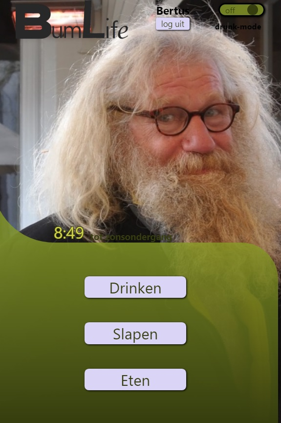

#BumLife

Dit is BumLife, de app om de levenswijze van de dak en thuislozen te ondersteunen.
Dit doet de app door verschillende plaatsen te zoeken die voor de doelgroep interessant kunnen zijn, 
zoals slaapplaatsen, en zaken waar eten of drinken gekocht kunnen worden.

screenshot van de hoofdpagina

###benodigdheden

BumLife maakt gebruik van 2 api's; een om weerdata op te halen, en een om locatie gegevens en kaarten op te halen.
In de **.env** file in de bronmap van de app moeten de volgende api-keys staan:

REACT_APP_API_KEY_WEATHER=7cdc14e16f454f3bd384c9786975e9f6

REACT_APP_API_KEY_MAPS=q3T-6l3scc4VFLtSh-pnUT9ortYCo34Zuer1YRFsp2g

###installatie-instructies:

Eerst moeten de node_modules geinstalleerd worden door het volgende commando in de terminal te runnen:

npm install

Wanneer dit geinstalleerd is, kan de applicatie gestart worden met behulp van:

npm start

###inloggegevens:

BumLife heeft een Alcocalculator waarmee de beste prijs voor alcoholische versnaperingen berekend kan worden.
Deze is alleen beschikbaar voor een aantal vooraf geregistreerde gebruikers.
Hieronder een lijst van de gebruikersnamen en hun wachtwoorden:

Gebruikersnaam: Bertus

Wachtwoord: streetLife64

Gebruikersnaam: Jan

Wachtwoord: Fietstas4ever

Gebruikersnaam: Hendrik

Wachtwoord: Goudstaafje43

Gebruikersnaam: Betsy

Wachtwoord: CatLady9Smells

