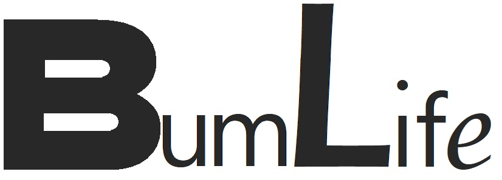
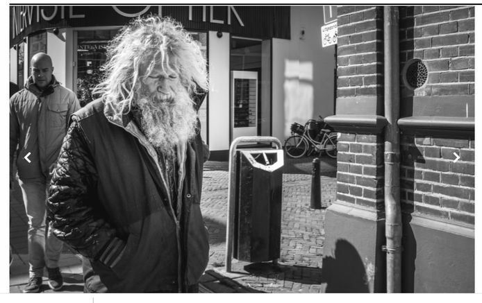

### Inhoudsopgave:

1. Inleiding
2. Probleembeschrijving
3. Functionele- en niet-functionele-eisen
4. Inspiratiebronnen
5. Use cases

---

### 1: Inleiding

**BumLife** is de applicatie voor dak en thuislozen, met in het bijzonder de gulzige alcohol-consument!

Vind gemakkelijk en snel een plek om alcohol-houdende versnaperingen te kopen en te drinken!

Sta je in de supermarkt en lukt het je “lorumstandigheden” niet om uit te rekenen hoe je kostentechnisch het beste
beschonken kunt worden? **BumLife** rekent het voor je uit!

Natuurlijk is het moeilijk om al die hedendaagse technologie te gebruiken met een treetje export-pils of twee flesjes
sherry op, daarom is **BumLife** gebruiksvriendelijk en “Drunk-proof”, met een duidelijke en eenvoudige lay-out.

Is dat alles?! Nee natuurlijk niet! Met **BumLife** kun je zien of je heerlijk “outdoor” in het park kunt overnachten,
of dat het toch echt weer is om een brug of parkeergarage op te zoeken. Voor de echte “high-roller” kan **BumLife** ook
een dakloze opvang in de buurt zoeken, of verblijf je liever in hotel “De Platte Pet”? Dan zoekt **BumLife** het
dichtstbijzijnde politiebureau om op creatieve wijze een cel te bemachtigen!

Ook de doorgewinterde drinker heeft zo af en toe goesting in een hapje buiten de spreekwoordelijke deur, dus in plaats
van het atten van een blik bruine bonen in een duister steegje kunnen we zo af en toe onze **BumLife** app aanslingeren
om op te zoeken waar we een fancy broodje shoarma of een classy bakje patat kunnen scoren, vergeet er niet voor de
gelegenheid een paar blikjes a-merk bier bij te scoren!

*“You lost your car, your house and your wife?*
*Forget about it all with BumLife©!”*

---

### 2: Probleembeschrijving

In beschonken toestand kan het leven erg moeilijk zijn. De gemiddelde benadeelde van dak- en-thuisloosheid kan tegen de
volgende problemen aan lopen:

- wat voor weer wordt het aankomende nacht.
- waar zijn alcoholhoudende versnaperingen verkrijgbaar.
- hoe kan de beste prijs voor de meeste alcohol in een product berekend worden.
- waar is een geopende snackbar of shoarmazaak.
- waar is een politiebureau.
- waar is een daklozenopvang.
- waar is een brug of parkeergarage.
- waar is een park.

Voor bovenstaande problemen biedt de BumLife app uitkomst, met behulp van een weer API, de Maps API, en een tool waarmee
de beste prijs voor dranken met een alcoholisch karakter gemakkelijk berekend kan worden.

---

### 3.1: functionele eisen

De **BumLife** app:

- laat een home pagina zien met 3 knoppen; "Eten", "Drinken" en "Slapen" die naar hun respectievelijke pagina's leiden.
- laat op alle pagina's zien hoe lang het nog duurt tot de zon ondergaat.
- laat op de pagina "Eten" data zien over snackbarren en shoarma zaken in de buurt zien, opgehaald met een maps API.
- laat op de pagina "Drinken" de gebruiker kiezen uit de rekentool (Alcocalculator) en een pagina met supermarkten in de
  buurt (Alcoholocator) door twee knoppen die naar hun respectievelijke pagina's leiden.
- vraagt de gebruiker voor de "Alcocalculator" gebruikt kan worden in te loggen met een bestaande gebruikersnaam en
  wachtwoord.
- laat in de "Alcocalculator" de gebruiker de goedkoopste optie is om het meeste alcohol te verkrijgen berekenen, dit
  door de inhoudsmaat, het alcoholpercentage en de prijs in te voeren, hier komt een prijs per liter alcohol uit.
- laat in de "Alcocalculator" de gebruiker, na het uitrekenen van een prijs per liter alcohol een extra rekentool zien
  waardoor vergelijken mogelijk wordt.
- laat op de "Alcoholocator" pagina data zien van supermarkten uit de buurt.
- laat op de "overnachten" pagina data zien van de weer API over het weer van aankomende nacht.
- laat als de temperatuur aankomende nacht boven 10 graden is en er geen regen wordt verwacht op de "slapen" pagina
  twee knoppen zien; "binnen" en "buiten"
- laat als de temperatuur aankomende nacht boven 10 graden is en er regen wordt verwacht op de "slapen" pagina
  twee knoppen zien; "binnen" en "overdekt"
- laat als de temperatuur aankomende nacht onder 10 graden is op de "slapen" pagina twee knoppen zien; "binnen" en
  "overdekt".
- geeft de gebruiker de locatie van parken in de buurt als de gebruiker de optie "buiten" op de "slapen" pagina
  kiest.
- geeft de gebruiker de locatie van bruggen en parkeergarages in de buurt als de gebruiker de optie "overdekt" op de 
  "slapen" pagina kiest.
- vraagt de gebruiker of hij of zij over genoeg geld beschikt voor de opvang als de gebruiker de optie "binnen" op de 
  "slapen" pagina kiest.
- geeft de gebruiker de locatie van een opvang in de buurt als de gebruiker de optie "ja" op de "genoeg-geld" vraag na
  de "binnen" optie op de "slapen" pagina kiest.
- geeft de gebruiker de locatie van een politiebureau in de buurt als de gebruiker de optie "nee" op de "genoeg-geld"
  vraag na de "binnen" optie op de "slapen" pagina kiest.
- heeft een "drunk modus" waar de hele app nog duidelijker weergeven wordt, en simpeler beschreven, deze is overal in de
  app aan en uit te zetten, ook heeft deze "drunk-mode" invloed over de hele app.
- vraagt de gebruiker in "drunk modus" op de "drinken" pagina of de aanschaf van alcohol in deze toestand wel verstandig
  is.
- geeft de gebruiker na de "aanschaf-van-alcohol-in-deze-toestand-wel-verstandig-vraag" de optie om terug keren naar de
  hoofd pagina.
- geeft de gebruiker na de "aanschaf-van-alcohol-in-deze-toestand-wel-verstandig-vraag" de optie om verder gaan met de
  rekentool in "drunk mode".
- geeft de gebruiker na de "aanschaf-van-alcohol-in-deze-toestand-wel-verstandig-vraag" de optie om te claimen dat hij
  of zij toch niet zo dronken is en verder te gaan met de rekentool en uit de "drunk mode" te gaan.

### 3.2: niet-functionele-eisen

De **BumLife** app maakt het gebruik prettiger door:

- tijdens het ophalen van data van de API's een 'even geduld' melding te laten zien.
- op de "eten" pagina de mogelijkheid te geven om terug te keren naar de hoofdpagina.
- op de "drinken" pagina en alle pagina's die via deze pagina te bereiken zijn de mogelijkheid te geven om terug te
  keren naar de hoofdpagina.
- op de "slapen" pagina alle pagina's die via deze pagina te bereiken zijn de mogelijkheid te geven om terug te keren
  naar de hoofdpagina.
- de gebruiker te laten kiezen om na het ophalen van locatie gegevens naar de google maps site/app te gaan om naar deze
  plaats toe te navigeren.
- goed toegankelijk te zijn voor telefoonschermen.
- in de "Alcocalculator" verwelkomt de app de ingelogde gebruiker met zijn of haar naam.
- in de "Alcocalculator" voorgeprogrammeerde producten met gangbare inhoudsmaten en alcoholpercentages aan de gebruiker
  te laten zien.
- in de "Alcocalculator" de uitkomst groen, oranje en rood te kleuren naarmate de prijs per liter alcohol stijgt.
- duidelijke foutmeldingen te laten zien bij een probleem van het ophalen van de data.
- duidelijke foutmeldingen te laten zien bij het niet aanstaan van de locatie van het apparaat van de gebruiker.
- als de temperatuur aankomende nacht boven 10 graden is en er geen regen wordt verwacht, de optie "buiten" op de 
  "overnachten" pagina aan te raden.
- als de temperatuur aankomende nacht onder 10 graden is de optie "binnen" op de "overnachten" pagina aan te raden.

---

### 4. Inspiratiebronnen

####1. Adobe xd voorbeeld fitness app van Howard Pinsky. 
De algehele visuele stijl vond ik organisch, veel afgeronde vormen en een prettige 'flow'.
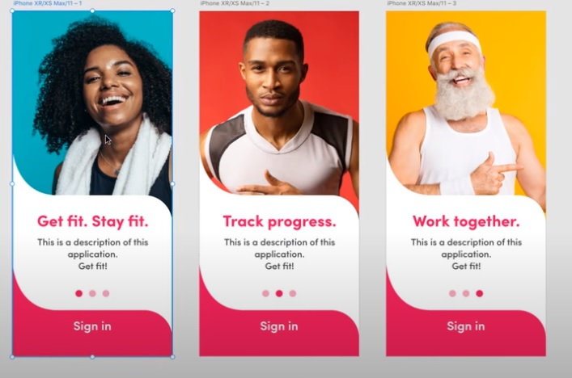

####2. Twitter.
Voor de "Alcocalculator heb ik mij laten inspireren door het aanmeldformulier van twitter", de open invoervelden geven
een open gevoel, net als de selectors.
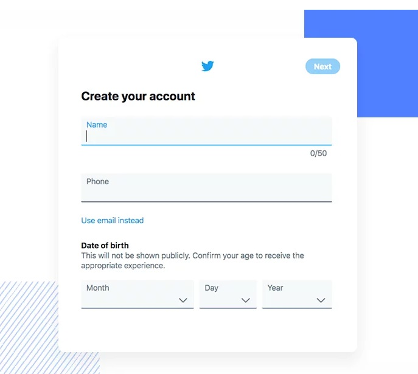

####3. Google.
Voor de locatie-gegevens op de "eten" pagina, de "slapen" pagina en de "Alcoholocator" heb ik de google zoekresultaten
als voorbeeld genomen, de manier waarop de gebruiker daar duidelijk en doelgericht informatie verkrijgt,
past goed bij mijn applicatie.
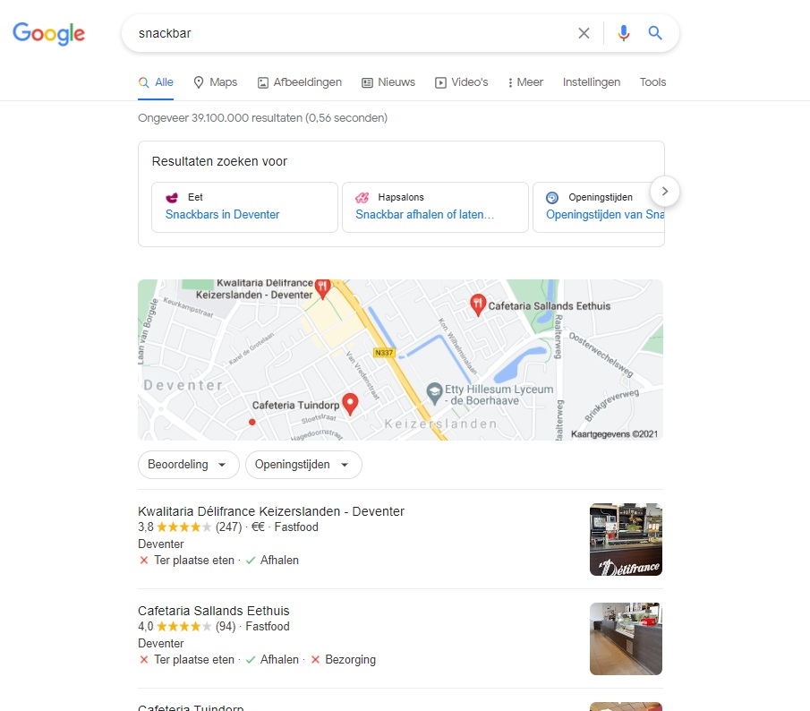

####4. Android simple mode
De *BumLife* app heeft een "drunk mode" die veel weg heeft van de simpele modus van het android
besturingssysteem.
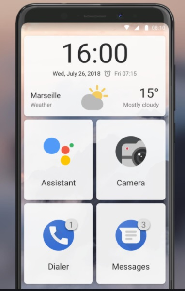

---

### 5. Use Cases

#### Use case 1: "Alcocalculator"

Bertus is net wakker en kan na een zware nacht wel een kleine oppepper gebruiken, helaas heeft hij niet veel geld.
Eenmaal aangekomen in de supermarkt start hij zij **BumLife** app op en tikt op Alcocalculator.

- Actor: Bertus Rietman (gebruiker)
- Trigger: gebruiker opent de rekentool (Alcocalculator)
- Main succes scenario: 
1. gebruiker selecteert het soort drank uit een lijst.
2. gebruiker selecteert de inhoudsmaat uit een lijst (aangepast na de vorige keuze)
3. gebruiker selecteert het alcohol percentage uit een lijst (aangepast na de eerste keuze)
4. gebruiker voert de prijs in.
5. de gebruiker ziet soort drank en een prijs per ml alcohol, en de leeggemaakte rekentool.
6. gebruiker selecteert een andere soort drank uit een lijst.
7. gebruiker selecteert de inhoudsmaat uit een lijst (aangepast na de vorige keuze)
8. gebruiker selecteert het alcohol percentage uit een lijst (aangepast na de keuze in stap 6)
9. gebruiker voert de prijs in.
10. de gebruiker ziet onder de uitkomst van stap 5 de nieuwe uitkomst en de leeggemaakte rekentool.
11. de gebruiker kiest de voordeligste drank.

#### Use case 2: "Buiten slapen"

Het begint donker te worden en Jan is al aardig van de kaart. Het wordt tijd om de slaapzak uit de fietstas te halen en
een plekje te zoeken om te slapen, het is nog warm en droog, maar halverwege de nacht doorweekt wakker worden van een
plensbui is natuurlijk ook niet prettig.

- Actor: Jan van Dijk (gebruiker)
- Trigger: gebruiker kiest de "slapen" optie op de hoofdpagina.
- Main succes scenario:
1. gebruiker ziet op "slapen" pagina het weer van aankomende nacht en stelt vast dat het gaat regenen en het ongeveer 15
   graden wordt.
2. de gebruiker kiest de optie "overdekt"
3. de gebruiker ziet bruggen en parkeergarages in de buurt op de pagina verschijnen.
4. de gebruiker kiest een locatie en tikt op de "go" optie hierna wordt hij doorgelinkt naar de maps-app waarmee hij
   zijn route kan vervolgen.
   
#### Use case 3: "Eten"

Na een drukke dag pilzen lust Hendrik wel wat, zijn uitkering is net overgemaakt, tijd voor een feestmaal!
Maar door de eerdergenoemde versnaperingen heeft Hendrik geen idee meer van zijn huidige locatie, ook ziet hij
hierdoor niet duidelijk meer.

- Actor: Hendrik van Heuckenroth (gebruiker).
- Trigger: gebruiker kiest de "eten" optie op de hoofdpagina.
- Main succes scenario:
1. gebruiker zet de "Drunk-mode" aan, hierdoor wordt de tekst op de app leesbaarder en alle content
   simpeler omschreven.
2. de gebruiker ziet snackbars en shoarmazaken in de buurt op de pagina verschijnen.
3. de gebruiker kiest een locatie en tikt op de "go" optie hierna wordt hij doorgelinkt naar de maps-app waarmee hij
   zijn route kan vervolgen.

#### Use case 4: "Binnen slapen"

Het is een koude nacht in februari en Betsy heeft het behoorlijk fris, helaas kan ze een plekje in de opvang niet
financieren en is buiten slapen ook geen comfortabele optie. Dan krijgt Betsy een ingeving! **BumLife**!

- Actor: Betsy LeChat (gebruiker)
- Trigger: gebruiker kiest de "slapen" optie op de hoofdpagina.
- Main succes scenario:
1. gebruiker ziet op "slapen" pagina het weer van aankomende nacht en ze stelt vast dat het gaat sneeuwen en het 
   ongeveer 12 graden gaat vriezen.
2. de gebruiker kiest de optie "binnen"
3. de gebruiker wordt gevraagd of zij over genoeg geld voor de opvang beschikt.
4. de gebruiker kiest de "nee" optie.
5. de gebruiker ziet politiebureaus in de buurt op de pagina verschijnen.
6. de gebruiker kiest een locatie en tikt op de "go" optie hierna wordt hij doorgelinkt naar de maps-app waarmee zij
   haar route kan vervolgen.
   
Betsy arriveert bij 'hotel' "De Platte Pet" en begint daar allerlei oerwoudgeluiden te maken, de
dienstdoende portier laat haar op geheel gepaste wijze binnen. Voila! Een kamer met ontbijt en koffie, perfect geschikt 
voor Betsy's budget! Checkout tijd van deze 0-sterren accommodatie is altijd een verassing!

---

### 6. Wireframes

####1. Hoofdpagina

Dit is de main pagina, hier start de app en vanuit is overal naar toe te navigeren.
Ik heb gekozen voor een eenvoudig ontwerp, zonder overbodige informatie.

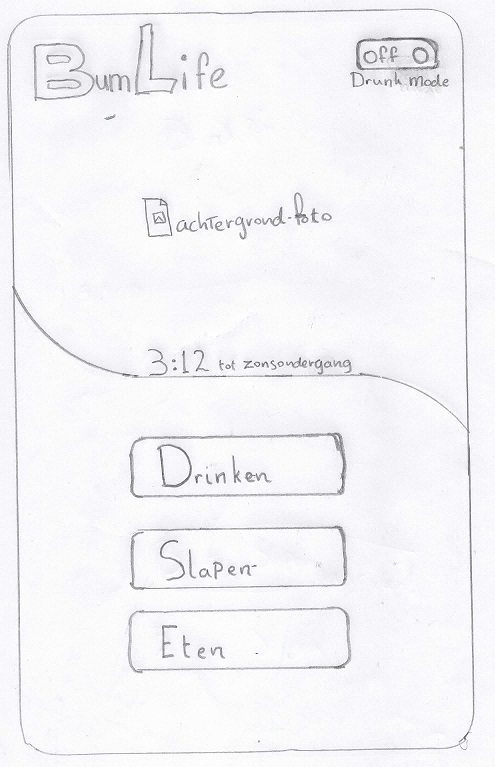

####2. "Eten" pagina

Dit is de "eten" pagina, deze pagina is vergelijkbaar met de andere pagina's waar de app locaties ophaalt zoals de
"Alcoholocator" en de verschillende pagina's na de "slapen" pagina

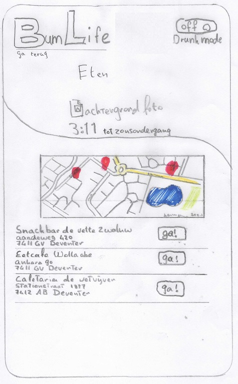

####3. "Drinken" keuze pagina

Hieronder kan de gebruiker kiezen om verder te navigeren naar de "Alcoholocator" of de "Alcocalculator".
Ik heb ervoor gekozen om dit in een aparte pagina af te handelen in plaats van op de hoofdpagina, om de hoofdpagina
overzichtelijk te houden.

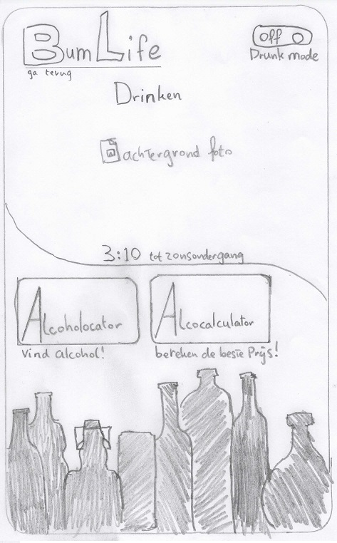

####4. "Slapen" keuze pagina

Hieronder leest de gebruiker een beknopte weersvoorspelling van aankomende nacht.
Ook kan de gebruiker kiezen om verder te navigeren naar "buiten slapen" (afhankelijk van de weersomstandigheden
kan dit ook "overdekt slapen" zijn) of "binnen slapen".
Ik heb ervoor gekozen om dit in een aparte pagina af te handelen in plaats van op de hoofdpagina, om de hoofdpagina
overzichtelijk te houden.

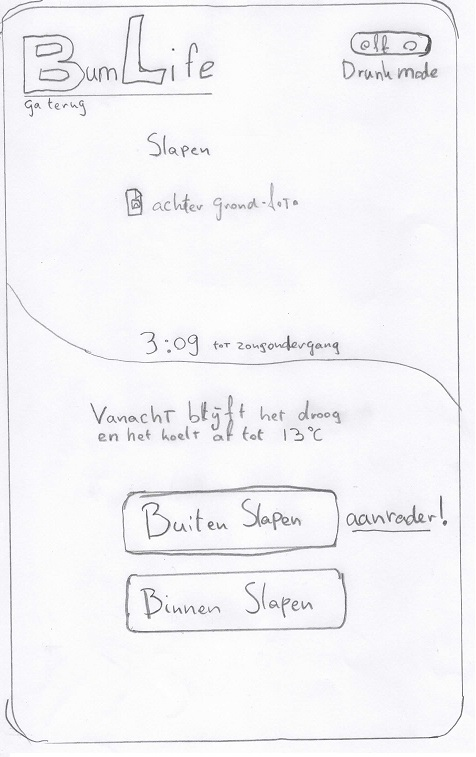

####5. "Alcocalculator"

Dit is de "Alcocalculator", het is de bedoeling dat de gebruiker in de dropdown menu's de juiste gegevens selecteert,
als de gebruiker in het dropdownmenu "anders" selecteert rendered de app een invoerveld om zelf gegevens in te voeren.
aan de zijkant komen de eerder in deze sessie ingevoerde uitkomsten te staan zodat er vergeleken kan worden.

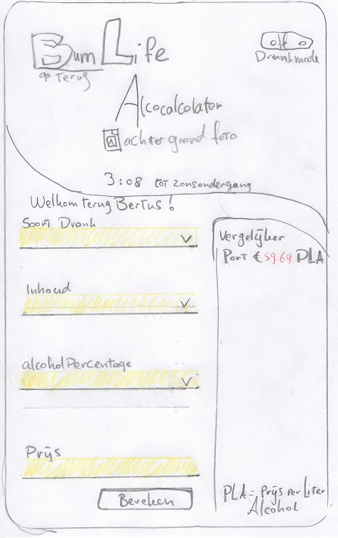

